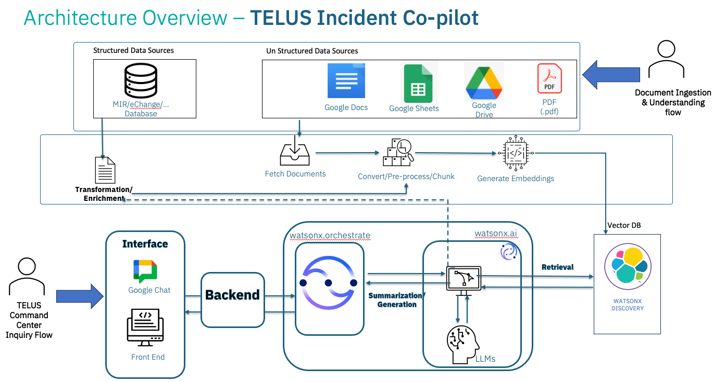
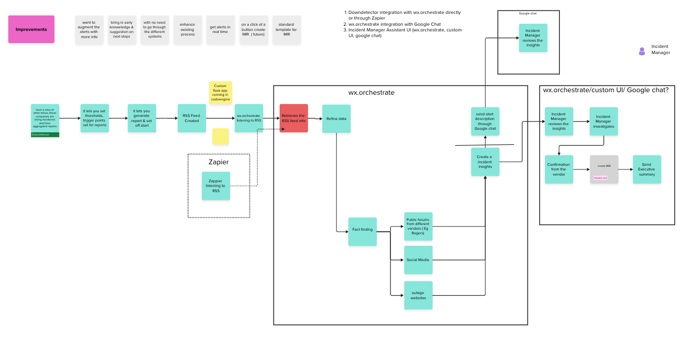

# Client Engineering Git Repo Asset Template

### Provide Project / Asset Overview 

Enhance incident management and resolution by developing a conversational Incident Co-pilot. The solution will automatically generate step-by-step resolution playbooks for common incidents, leveraging historical data and industry best practices to suggest corrective actions or next best steps. It will also trigger predefined workflows to accelerate response times.
In the long term, the goal is to align with TMF standards, driving consistency, while enabling system-assisted, human-led network automation for more efficient and intelligent operations.

### Squad

**CE AI Engineers:**
Anitha M
Denis Askin
Keshav Gaur
Nayef Abou Tayoun
Reethu Thomas
Vivek Rathi

**CE Designers:**
Smeet Yeolekar
**Platform Engineer:**

**Solution Architect:**

**CE Business Technology Leaders:**
Nandita Patyal
**CE Manager:**
Sprios Mavromihelakis

### Industry 
Telco
**Industry:** Telco

**Market:** Canada

----

## Technical Component 1

### Overview

Provide a quick technical overview of the technical component - the technologies used and how they interact with other.

### Key Features

- **Feature Highlight 1:** 

- **Feature Highlight 2:** 

## Technical Component 2

Provide a quick technical overview of the technical component - the technologies used and how they interact with other.

### Overview 

### Key Features

- **Feature Highlight 1:** 

- **Feature Highlight 2:** 

----
# Architecture 

----
# Setup Guide

## Part 0: Prerequisites

To work with this repository, you will need the following components:

-
-
-

##  Part I: Set Up for Development

Follow these steps to set up your environment:

**1. (Example) Set up TechZone Environment**
- Log into techzone.ibm.com
-
-

**2. (Example) Set up watsonx.ai**
- Go to cloud.ibm.com to get your API key
-
-

## Part II: Set up for Deployment

Once you have validated the assets in development, follow these steps to deploy on OpenShift / Code Engine / Watson Machine Learning:

-
-
-

## Part III: Integrating with other applications like watsonx Assistant

Once the deployment is ready, you can call it from watsonx Assitant by following the steps below:

-
-
-
